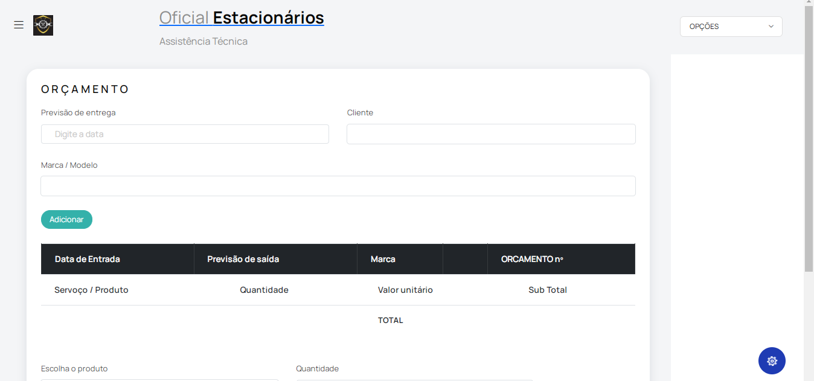
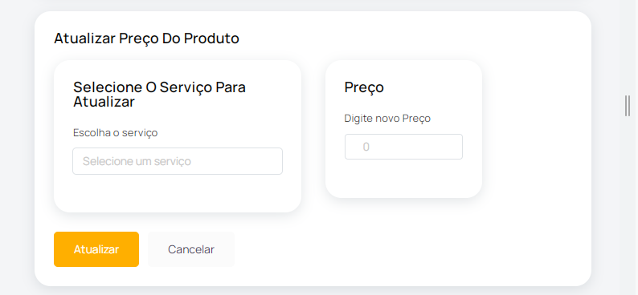
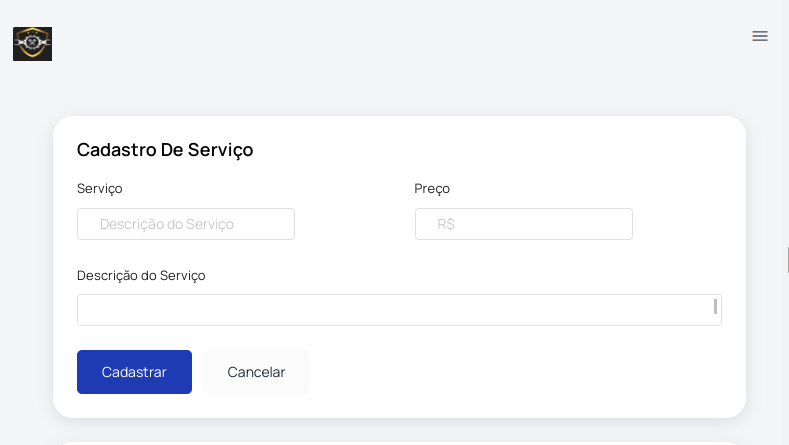
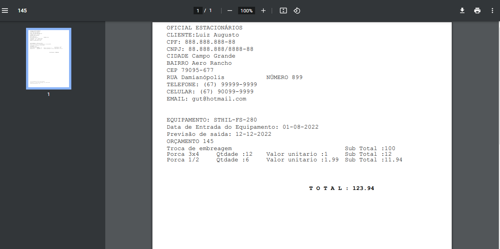

## Sistema de controle de orçamento simples

Esse é um pequeno e simples controle de orçamento, escrito em Laravel e Livewire:

- Cadastro de Produto. Modele e Marca
- Cadastro de Serviço
- Emite orcamento 
- Data automática de entrada do equipamento
- Da prevista para saída da oficina.
- Emissão do orçamento em PDF para envio no wathsapp.
- Cadastro de Cliente

## Dúvidas / Instalação

n0cturn0.debian@gmail.com 

Clonar projeto

Não executar migration. Entidades diferente da versão existente na migrations

## License

The Laravel framework is open-sourced software licensed under the [MIT license](https://opensource.org/licenses/MIT).
